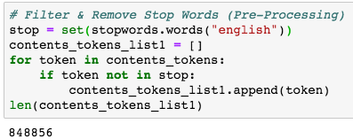
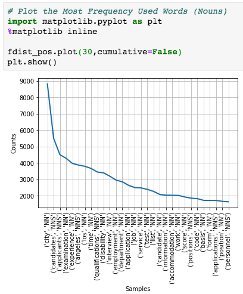
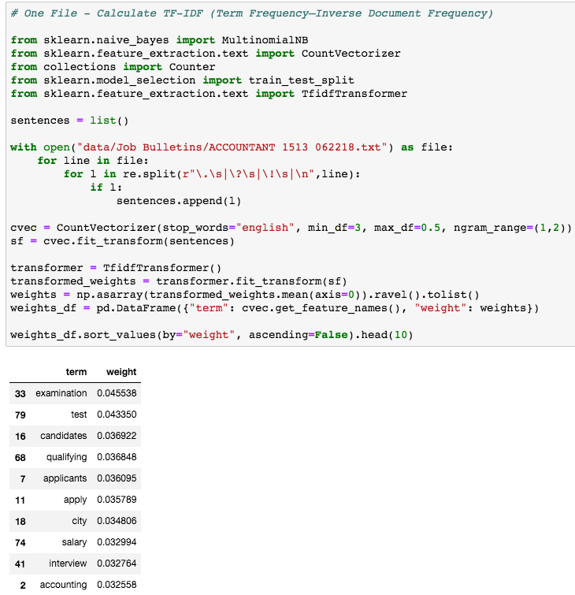

# Natural Language Processing City of Los Angeles Job Descriptions

"Choose a job you love, and you will never have to work a day in your life" - Confucius

## Background

* The content, tone, and format of job bulletins can influence the quality of the applicant pool
    * Overly-specific job requirements may discourage diversity
* The Los Angeles Mayor’s Office wants to reimagine the city’s job bulletins to identify needed improvements.
* The goal is to use a folder full (683 to be exact) of plain-text job postings then to use this data to: 
    1. Identify language that can negatively bias the pool of applicants; 
    2. Improve the diversity and quality of the applicant pool; and
    3. Inform based on findings to update job listings

## Objectives

Help the City of Los Angeles to Structure and Analyze its Job Descriptions Using Natural Language Processing

* The City of Los Angeles faces a big hiring challenge: 
    * 1/3 of its 50,000 workers are eligible to retire by July of 2020.
    * The city has partnered with Kaggle to create a competition to improve the job bulletins that will fill all those open positions.
    * Kaggle Competition: https://www.kaggle.com/c/data-science-for-good-city-of-los-angeles

### Tools

* Natural Language Toolkit (https://www.nltk.org/)
* Pandas
* Matplotlib
* Word Cloud

### Process I

Tokenize: 
* Break up strings into small structures/units to understand the importance of each word with respect to the sentence

Stop-Words: 
* Commonly used words (such as "and", "the", "a", "an", and similar words) that are irrelevant and have very little meaning

Regular Expressions: 
* Filter ReGex only and remove symbols and characters

POS Tagging: 
* Assigning tags to a single word according to its role in the sentence (i.e Verb, Noun, Adjective and etc.

FreqDist():
* Determine Frequency Distribution of the words in the corpus

### Process II

Readability Index:
* Readability is the ease with which a reader can understand a written text
* In natural language, the readability of text depends on its content (the complexity of its vocabulary and syntax)
    * It focuses on the words we choose, and how we put them into sentences and paragraphs for the readers to comprehend

### Process III

TF-IDF (Term Frequency-Inverse Document Frequency):
* A technique to quantify a word in documents to determine the importance of the word in the document (corpus)
* Works by increasing proportionally to the number of times a word appears in a document, but is offset by the number of documents that contain the word
    * So, words that are common in every document, such as this, what, and if, rank low even though they may appear many times, since they don’t mean much to that document in particular

### Roadblocks

NLTK vs. SpaCy
* We tried 2 different Natural Language Processors
    * NLTK
    * SpaCy
* Many say SpaCy uses the latest and best algorithms , and has a higher performance
* NLTK is a better string processing library that takes strings as input and returns strings or lists of strings as output.

The Data
* Size of the data killed Kernels multiple times when analyzing them as a whole
* Cleaning/Pre-Processing the data was time consuming because of the amount of words, 1.18  million, and selecting the right words to analyze, such as: Nouns or Verbs or Adjectives and etc.

Decisions, Decisions
* Once we had the data  and started cleaning it, we then needed to decide how to use NLP in an effective way
* After reading the Job Bulletins, the problems were obvious, but how can we show that conclusively with the data

## Conclusions

Word Counts
* There are too many words per Job Bulletin at an average of 1200
* Newer generations have shorter attention spans

Frequency of Words
* The frequency of some words in the Job Bulletins could scare some candidates off: 
    * ex: Examination

Readability Indexes
* Dale-Chall Readability Score:
    * Average Score: 9.0 – 9.9
    * 13th to 15th grade college student

* Flesch Reading-Ease:
    * Average Score: 0-29
    * Very Confusing

TF-IDF
* Most important words:
    * Examination
    * Test
    * Candidates
    * Qualifying
* Not ideal words to attract candidates

## Next Steps

Watson Natural Language Classifier:
* Allows users to Classify Text into custom categories, at scale
    * Classify jobs further to ensure accuracy of descriptions, requirements and expectations
* Combine various advanced ML techniques to provide the highest accuracy possible
* Utilize multiple classification models, along with unsupervised and supervised learning techniques
* Evaluate data against multiple Support Vector Machines (SVMs) and a Convolutional Neural Network (CNN) using IBM’s Deep Learning As a Service (DLaaS)
